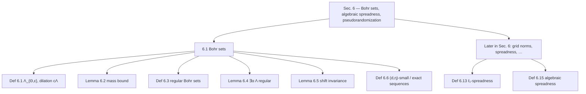
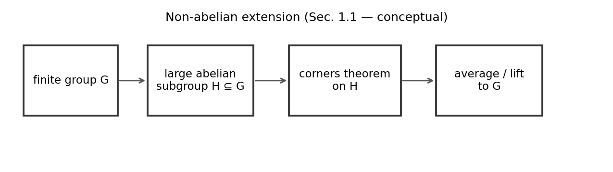
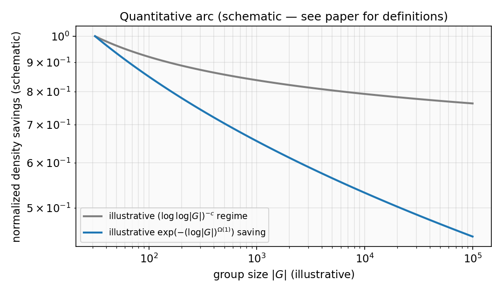
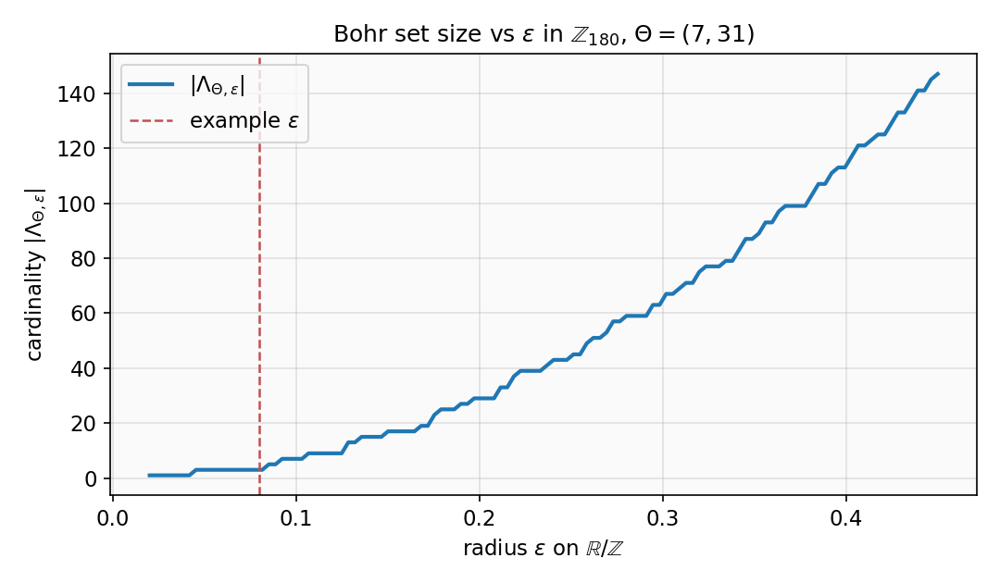
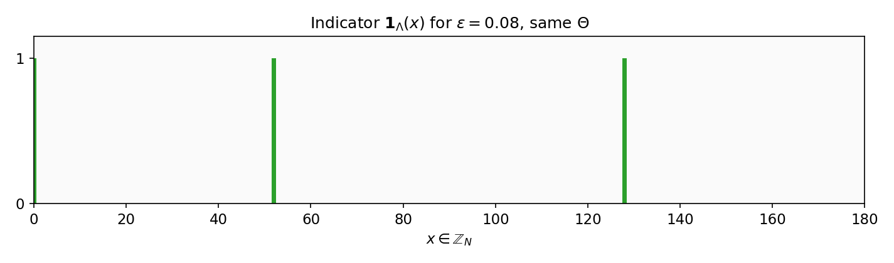
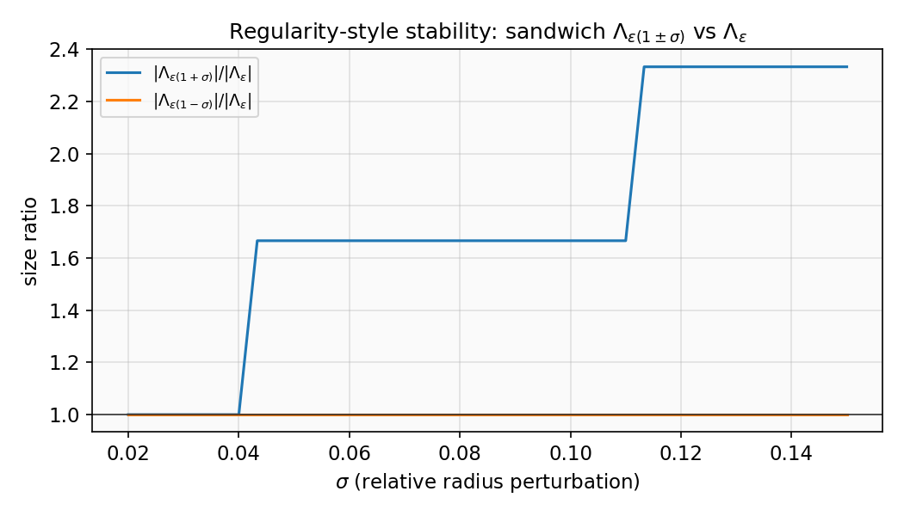
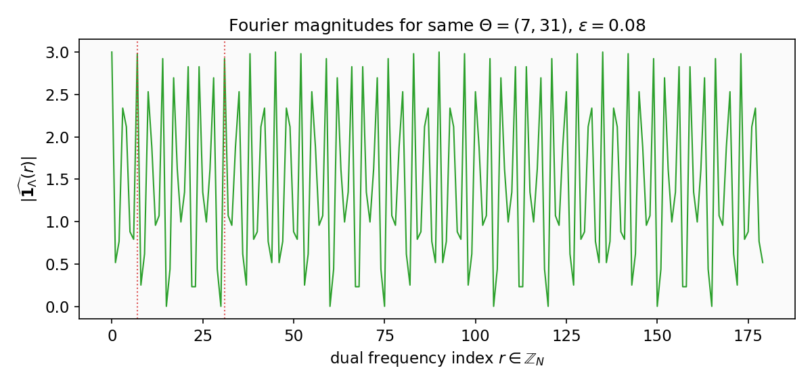

# Bohr Set Visualizer

## Description

The **Bohr Set Visualizer** is a **Streamlit** research app plus Python numerics for **Bohr sets** $\Lambda_{\Theta,\varepsilon}$ inside $\mathbb{Z}_N$, motivated by the corners theorem proof for general abelian groups in Jaber–Liu–Lovett–Ostuni–Sawhney ([arXiv:2504.07006](https://arxiv.org/abs/2504.07006)). It turns dense definitions (regular Bohr sets, relative sifting, $(d,\eta)$ chains, $\ell_1$-spreadness, dual Fourier spectrum, and qualitative links to Sec. 7 and Sec. 8) into **plots and sliders** you can change live.

**Scope.** The implementation fixes $G=\mathbb{Z}_N$ with explicit characters $\chi_\theta(x)=e^{2\pi i \theta x / N}$; the README also summarizes how such abelian inputs relate to **extensions beyond abelian groups** and **coloring** results stated in the paper.

**GitHub “About” (one line, copy-paste):**  
*Interactive Streamlit tool: Bohr sets in ℤ_N, regularity, sub-Bohr sifting, increment chains, ℓ₁-spread and Fourier views, pair-health proxy, and coloring pedagogy—aligned with arXiv:2504.07006 (quasipolynomial corners).*

**Math in this file** uses GitHub’s `$…$` / `$$…$$` syntax so formulas render in the GitHub web UI.

---

## Paper reference (PDF)

| Copy | Path |
|------|------|
| **Current (Cursor workspace)** | `c:\Users\adith\AppData\Roaming\Cursor\User\workspaceStorage\e0f943467b0a7cf1dc5dcf6b6f4194bc\pdfs\b0e9945c-06fe-4c99-89b3-c9e09200ecec\2504.07006v2 (1).pdf` |
| Other workspace copies | `…\0b984680-ef1a-48bb-bf61-1afb12277129\…`, `…\ba6baa42-86cb-4ab0-8c4b-3d1c72ba8949\…`, `…\b6b3e01f-9e8f-4de2-bc0a-3587d1e9a389\…`, `…\32e81826-9a93-4e51-9a32-2e7cd4f2312a\…` |

All refer to the same arXiv revision: **2504.07006v2** ([abstract](https://arxiv.org/abs/2504.07006)).

---

## Section 6 structure (paper)

The corners proof for **general abelian groups** replaces subspaces with Bohr sets; Section 6 develops Bohr sets, spreadness, and pseudorandomization. Dependency outline:



---

## Non-abelian groups (Section 1.1): where $\mathbb{Z}_N$ fits

The main theorem is stated for **finite abelian** $G$, but the introduction explains a striking extension: **quasipolynomial** corner bounds for abelian groups imply analogous bounds for **every finite group** $G$, including non-abelian ones. The pipeline (Fox-type argument, as discussed in Sec. 1.1) is:

1. **Find a large abelian subgroup** $H \leq G$ (every large finite group contains a proportional abelian piece).
2. **Run the abelian theory** on $H$ — Bohr sets, relative sifting, grid norms, and the diagonal “$\ell_1$-spread” phenomena you simulate here are native to that step.
3. **Average / lift** from $H$ back to $G$ so that dense corner-free structure in $G$ cannot evade the abelian obstruction.

**Implementation link.** This repository only draws **$G = \mathbb{Z}_N$**, but that model is exactly the kind of **abelian building block** that feeds the general proof: Bohr sets are the right **containers** inside $H$; the lift to arbitrary $G$ is conceptual, not a different codebase.



*Schematic (Sec. 1.1). The paper explains how abelian bounds transfer to all finite $G$ via a large abelian $H$ and an averaging / lifting step. This figure is a storytelling aid, not a literal algorithm.*

---

## Coloring and the “tower” warning (Section 8)

The paper’s **coloring** corollary (Corollary 1.2, Sec. 8) addresses **$G \times G \times G$** with about **$L \asymp \log\log\log \lvert G\rvert$** colors, forcing a **monochromatic corner**. The authors stress that with **only** doubly-logarithmic density savings (as in Shkredov’s classical regime), one would face **tower-type** losses in how many colors can be handled — i.e. the quantitative strength of the new bound is what makes a **polylogarithmic-in-log** color count possible.

**Visualizer add-on.** Under **Tab 1 → “Coloring strip”**, the app assigns an **$L$-coloring** of $\mathbb{Z}_N$ (either $x \bmod L$ or i.i.d. random) and reports how many colors appear on the current Bohr set $\Lambda$, whether $\Lambda$ is monochromatic, and the exact probability $L^{1-\lvert \Lambda\rvert}$ that a **fully random** coloring makes $\Lambda$ monochromatic. That toy is **1-dimensional**; it is meant only to build intuition for why density decay **stronger than** $(\log\log \lvert G\rvert)^{-c}$ matters for multicolor statements.

---

## Quantitative arc: why 2025 is a breakthrough

| Aspect | Shkredov (2006) corner bound | Jaber et al. (2025) |
|--------|------------------------------|----------------------|
| **Strength** | Doubly logarithmic: density $\ll (\log\log \lvert G\rvert)^{-c}$ | **Quasipolynomial**: $\lvert A\rvert \le \lvert G\rvert^2 \exp\bigl(-(\log \lvert G\rvert)^{\Omega(1)}\bigr)$ |
| **Core mechanism** | $L^2$ / energy-style increment | **Relative sifting**, **Bohr containers**, **Gowers grid norms**, **asymmetric** treatment of the diagonal $D$ ($\ell_1$-spread) |
| **Diagonal** | (Symmetric finite-field intuition) | **“Diagonal drop”**: $D$ is not assumed algebraically spread like $X,Y$ |

The plot below is **illustrative only** (exponents are not those in the theorems). It compares the *shape* of a doubly-logarithmic saving with a *quasipolynomial*-type saving in $\lvert G\rvert$.



---

## How this repo sits in a larger “suite” (conceptual map)

| Focus | Role in the story |
|-------|-------------------|
| **Behrend-type constructions** | **Lower bounds** — how dense a corner-free set can still be. |
| **Grid norms / Von Neumann lemmas** | **Triggers** — when lack of uniformity forces structured increments. |
| **Bohr sets (this repo)** | **Containers** — soft structured neighborhoods inside general abelian groups. |
| **Exactly-$N$ / communication** | **Applications** — complexity consequences stated in the paper’s abstract. |

---

## Definitions from the paper (Section 6.1)

**Definition 6.1 (Bohr set).** Let $\varepsilon \in \mathbb{R}^+$, let $G$ be a finite abelian group, and $\Theta = (\Theta_1,\ldots,\Theta_d)$ with $\Theta_i \in \widehat{G}$ homomorphisms $G \to \mathbb{R}/\mathbb{Z}$. The Bohr set is

$$
\Lambda = \Lambda_{\Theta,\varepsilon} = \bigcap_{i=1}^{d} \Big\{ x \in G : \|\Theta_i(x)\|_{\mathbb{R}/\mathbb{Z}} \le \varepsilon \Big\},
$$

where $\|x\|_{\mathbb{R}/\mathbb{Z}} = \min_{z \in \mathbb{Z}} \lvert x - z \rvert$. For $c > 0$, **dilation** is $c\Lambda_{\Theta,\varepsilon} = \Lambda_{\Theta,\,c\varepsilon}$. The paper calls $d$ the **dimension** and $\varepsilon$ the **radius** $\nu(\Lambda)$.

**Lemma 6.2.** If $\Lambda = \Lambda_{\Theta,\varepsilon}$ has dimension $d$ and radius $\varepsilon$, then

$$
\lvert \Lambda \rvert \ge \varepsilon^d \lvert G \rvert.
$$

**Definition 6.3 (Regular).** A Bohr set $\Lambda = \Lambda_{\Theta,\varepsilon}$ of dimension $d$ is **regular** if for all $\lvert c \rvert \le 1/(100d)$,

$$
1 - 100d\lvert c \rvert \;\le\; \frac{\bigl\lvert (1+c)\Lambda \bigr\rvert}{\lvert \Lambda \rvert} \;\le\; 1 + 100d \lvert c \rvert.
$$

**Lemma 6.5.** Let $f$ be $1$-bounded and $\Lambda$ a **regular** Bohr set of dimension $d$. If $\lvert c \rvert \le 1/(100d)$ and $n' \in c\Lambda$, then

$$
\mathbb{E}_{n \sim \Lambda}\, f(n) \;=\; \mathbb{E}_{n \sim \Lambda}\, f(n + n') \;+\; \mathcal{O}(c d).
$$

This captures **approximate shift-invariance** when the shift lies in a smaller dilate $c\Lambda$.

---

## Cyclic group model ($G = \mathbb{Z}_N$)

Characters are $\chi_\theta(x) = e^{2\pi i \theta x/N}$ with $\theta \in \{0,\ldots,N-1\}$. This repo implements

**$\ell_\infty$ ball:**

$$
\max_{\theta \in \Theta}\; \Bigl\| \frac{\theta x}{N} \Bigr\|_{\mathbb{R}/\mathbb{Z}} < \varepsilon .
$$

**Mean ($\ell_1$) ball:**

$$
\frac{1}{\lvert \Theta \rvert} \sum_{\theta \in \Theta} \Bigl\| \frac{\theta x}{N} \Bigr\|_{\mathbb{R}/\mathbb{Z}} < \varepsilon .
$$

These match Definition 6.1 once each $\theta x / N$ is interpreted in $\mathbb{R}/\mathbb{Z}$ (see `bohr_set.py`).

---

## Research simulation: mapping to the paper

The Streamlit app is not only drawing Bohr sets; it **simulates mechanisms** from the proof: relative sifting inside a sparse container, nested Bohr “zoom” chains, and **Definition 6.13** $\ell_1$-spreadness.

### Sub-Bohr sifting and relative density (Sections 2.2, 3.5)

**Problem (informal).** Classical sifting bounds degrade with the density of a majorant in all of $G$. If $A$ is tiny in $G$, crude estimates lose useful factors.

**What the tool reports.** For an outer Bohr container $B_1$ and sparse $A \subset B_1$, compare **global** density $\lvert A\rvert / \lvert G\rvert$ to **relative** density $\lvert A\rvert / \lvert B_1\rvert$, and track how much of $A$ falls into a smaller inner Bohr neighborhood $B_2$. That is the right mental model for **relative sifting**: locating a sub-instance where a set that is sparse globally is still **dense enough relative to $B_1$** (and refinable inside $B_2$) to feed a density-increment argument.

### Increment chains and $(d,\eta)$-small sequences (Sections 6.1, 6.6)

**Logic.** Definition 6.6 fixes a **$(d,\eta)$-small sequence**: same frequency set (rank $d$), nested Bohr sets with radii shrinking so $\nu(B_{i+1})/\nu(B_i) \le \eta$.

**What the tool plots.** Radii $\varepsilon_i = \varepsilon_0 \eta^i$ at fixed $\Theta$, with cardinalities $\lvert \Lambda_{\Theta,\varepsilon_i}\rvert$. Dimension stays fixed while the radius collapses — the same “zoom” iteration that supports the density-increment loop (as in the proof structure toward results such as Theorem 7.9 in the paper).

### $\ell_1$-spread heatmap (Sections 6.1, 6.3; Definition 6.13)

**Breakthrough (informal).** The diagonal-type object $D$ is not treated with the same **algebraic spreadness** used for the other sides; the authors use **$\ell_1$-spreadness** (Definition 6.13) as a workable substitute.

**Definition 6.13 (as stated in the paper, with $B_1,B_2$ regular Bohr sets and $\nu(B_2)\le\nu(B_1)$).** A function $f:B_1\to[0,1]$ is $(B_1,B_2,\varepsilon)$ $\ell_1$-spread when

$$
\mathbb{E}_{x \sim B_1}\,\Bigl\lvert \mathbb{E}_{y \sim B_2}[f(x+y)] - \mathbb{E}[f] \Bigr\rvert \;\le\; \varepsilon \cdot \mathbb{E}[f],
$$

with $\mathbb{E}[f]=\mathbb{E}_{x\sim B_1}[f(x)]$.

**What the tool computes.** For $f = \mathbf{1}_A$ (extended by zero off $A$), it approximates the **left-hand side** above and compares it to $\varepsilon_{\mathrm{tolerance}} \cdot \mathbb{E}[f]$. The bar plot over $x \in \mathbb{Z}_N$ shows pointwise magnitudes $\bigl\lvert \mathbb{E}_{y \sim B_2}[f(x+y)] - \mathbb{E}[f]\bigr\rvert$ — empirical feedback for the **log-potential** style analysis that rules out persistent “dips below the mean” on bad pieces of $D$.

### Lab components vs paper concepts

| Lab component | Paper concept | Purpose |
|---------------|---------------|---------|
| **Sub-Bohr sifting** | Relative sifting (see Sec. 2.2, Sec. 3.5) | Find structure inside a sparse majorant $B_1$ by measuring density relative to $B_1$ and refinement inside $B_2$. |
| **Increment chain** | $(d,\eta)$-small / exact sequences (Def. 6.6) | Model the iterative Bohr “zoom” where rank is fixed and radius shrinks. |
| **$\ell_1$-spread analysis** | Definition 6.13 | Test stability of the diagonal-type direction when full algebraic spreadness is unavailable. |
| **Fourier spectrum (dual group)** | Sec. 6.2, Appendix A (almost periodicity) | $\bigl\lvert \widehat{\mathbb{1}_{\Lambda}}(r)\bigr\rvert$ over $r \in \mathbb{Z}_N$; compare energy at low modes and at the fixed $\Theta$ to see sparse frequency support. |
| **Balanced strip** | Balanced $f - \mathbb{E}[f]$ (Sec. 2, Sec. 4) | Visualize $\mathbb{1}_{\Lambda} - \alpha$ (global or on $B_1$) to see mean-zero “clumpiness” used in Gowers-type arguments. |
| **Pair health map (proxy)** | Sec. 7.1 (well-conditioned pairs), Lemma 7.5 (not poor) | Coarse 0–3 score from slice-stability of $X,Y$ and a $D$-tube check; **not** a full $(B_i,B_8,B_9,K,K)$ grid norm. |

### Presentation note ($\ell_1$-spread and the heatmap)

> **Why check $\ell_1$-spreadness on a heatmap?** In Section 6.3 the authors use a **log-potential** argument to show that if a set is not $\ell_1$-spread, it can be **partitioned** into pieces that are (cf. Lemma 6.21 and the surrounding recursion). The heatmap marks residues $x$ where the pointwise term $\bigl\lvert \mathbb{E}_{y \sim B_2}[f(x+y)] - \mathbb{E}[f]\bigr\rvert$ is large — i.e. where the obstructions to spreadness live and where “bad pieces” would be carved out in that partitioning step.

---

## Figures (generated)

These PNGs live under `docs/images/` and are referenced with **relative** paths so they render on GitHub. Regenerate after changing script defaults:

```powershell
python scripts/generate_readme_figures.py
```

### Core Bohr set views

**Cardinality vs radius** — $\lvert \Lambda_{\Theta,\varepsilon} \rvert$ for a fixed $\Theta \subset \mathbb{Z}_{180}$:



**Membership** in $\mathbb{Z}_N$ (same parameters):



**Regularity-style ratios** — sandwich $\Lambda_{\varepsilon(1\pm\sigma)}$ vs $\Lambda_\varepsilon$ (qualitative analogue of Definition 6.3):



### Fourier dual group (almost periodicity viewpoint)

**$\bigl\lvert \widehat{\mathbb{1}_{\Lambda}}(r)\bigr\rvert$** on $\mathbb{Z}_N$ (vertical lines at frequencies in $\Theta$):



### Conceptual diagrams (from earlier sections)


---

## Code map

| File | Role |
|------|------|
| `bohr_set.py` | Torus norm, $\Lambda_{\Theta,\varepsilon}$, regularity sandwich, random walk / TV, sub-Bohr sifting, Bohr chains, $\ell_1$-spread, **dual Fourier magnitudes**, **balanced function**, **pair-health proxy matrix** |
| `app.py` | Streamlit UI: nested $B_2 \subset B_1$, sparse $A$, Fourier spectrum, balanced strip, **coloring strip (Sec. 8 pedagogy)**, pair-health heatmap, earlier tabs |
| `scripts/generate_readme_figures.py` | Writes `docs/images/*.png` (Bohr curves, indicator, regularity, **Fourier**, **quantitative arc**, **non-abelian pipeline**) |

---

## Setup

```powershell
cd "c:\Users\adith\Bohr Set Visualizer"
pip install -r requirements.txt
streamlit run app.py
```

Python 3.10+ recommended.

### Tests

```powershell
cd "c:\Users\adith\Bohr Set Visualizer"
pip install -r requirements.txt
$env:PYTEST_DISABLE_PLUGIN_AUTOLOAD = "1"   # avoids broken third-party pytest plugins on some machines
python -m pytest tests/ -v
```

Or run `powershell -File scripts/run_tests.ps1`.

---

## License

No license file is included; add one if you redistribute.
